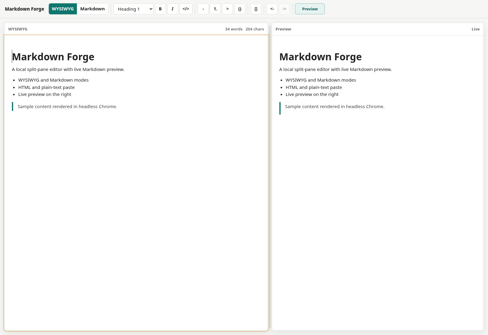

# Markdown Forge


A small local Markdown editor that runs in the browser.

## Snapshot



## What It Does

- Keeps each open document in its own tab with its own title, dirty state, editor mode, scroll state, undo/redo history, file handle, workspace folder, and image object URLs.
- Create, switch, close, scroll through, and reorder in-memory document tabs without discarding other open documents.
- Edit in WYSIWYG mode or plain Markdown mode.
- Paste rich HTML into the WYSIWYG editor.
- Paste plain text into the Markdown editor.
- Render Markdown image syntax such as `` in the editor and preview.
- Paste, drop, or insert PNG, JPEG, WebP, and GIF images in WYSIWYG workflows.
- Store inserted local images in an `assets/` folder inside a user-chosen workspace folder, then add relative Markdown links such as ``.
- See a live Markdown preview beside the editor.
- Hide or show the preview pane.
- Use the first toolbar row for the app title, active file name, New, Open, Save, Save As, and Recent files.
- Use the tab strip to switch documents by clicking a tab, close tabs, scroll through many open tabs, drag tabs into a new order, or create another untitled tab with `+`.
- Use the second toolbar row for headings, bold, italic, code, lists, quotes, links, undo, redo, mode switching, preview, and About.
- Open and save local `.md`, `.markdown`, and `.txt` files in browsers that support the File System Access API.
- Reopen recent files from an IndexedDB-backed recent-file list.
- Warn before closing a dirty tab or refreshing/closing the browser with dirty documents.
- Use file shortcuts: Ctrl/Cmd+N for a new tab, Ctrl/Cmd+O to open a file into a tab, Ctrl/Cmd+S for Save, and Ctrl/Cmd+Shift+S for Save As.
- Use tab shortcuts: Ctrl/Cmd+W closes the active tab, Ctrl/Cmd+PageUp/PageDown switches tabs, Ctrl/Cmd+Shift+PageUp/PageDown reorders the active tab, and Ctrl/Cmd+1 through Ctrl/Cmd+9 jumps to a tab by position.

Browsers without the File System Access API keep the editor working, but file controls are disabled.
Local image storage also requires browser file and folder access. The first pasted, dropped, or inserted local image asks for a workspace folder, and Markdown Forge creates or reuses that folder's `assets/` directory.

## Run It

Open this file in a browser:

```text
src/markdown_forge.html
```

No install step is needed.

## Project Layout

```text
assets/
├── MarkdownForge.ico
└── markdown-forge-snapshot.png
src/
├── markdown_forge.html
├── styles.css
└── js/
    ├── app.js
    ├── asset-store.js
    ├── document-session.js
    ├── editor-actions.js
    ├── file-store.js
    ├── history.js
    ├── markdown.js
    ├── recent-files.js
    ├── resizer.js
    ├── tab-manager.js
    ├── utils.js
    └── viewport.js
tests/
└── unit/
    └── tab-manager.test.js
```

## Tests

Run the dependency-free unit test with:

```text
node tests/unit/tab-manager.test.js
```

## License

MIT
