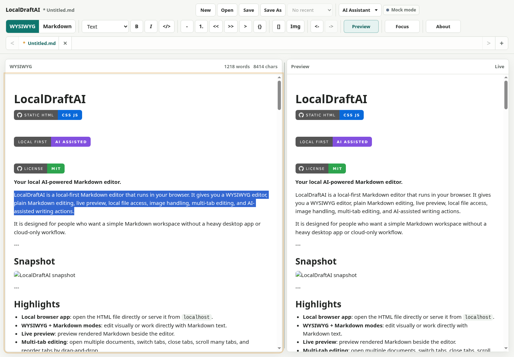

# LocalDraftAI


**Your local AI-powered Markdown editor.**

LocalDraftAI is a local-first Markdown editor that runs in your browser. It gives you WYSIWYG or Markdown editing in one focused editor surface, Soft Wrap for long Markdown lines, local file access, image handling, multi-tab editing, and AI-assisted writing actions.

Use it immediately at [https://localdraft.ai/](https://localdraft.ai/), or run the same static app from this repo when you want a fully local/offline copy.

It is designed for people who want a simple Markdown workspace without a heavy desktop app or cloud-only workflow.

---

## Snapshot



---

## Highlights

- **Use instantly online**: open [localdraft.ai](https://localdraft.ai/) and start writing without installing anything.
- **Local browser app**: open the HTML file directly or serve it from `localhost`.
- **WYSIWYG + Markdown modes**: edit visually or work directly with Markdown text in one main editor.
- **Soft Wrap**: wrap long lines visually in WYSIWYG and Markdown modes without inserting real line breaks.
- **Right-click clipboard actions**: cut, copy, and paste from the editor context menu; WYSIWYG copy/paste keeps rich HTML when the browser clipboard allows it.
- **Basic Markdown blocks**: render and insert headings, lists, block quotes, code fences, images, links, and horizontal rules.
- **Escaped Markdown characters**: literal Markdown punctuation such as `\*`, `\#`, `\|`, and `\>` stays literal when editing visually.
- **Multi-tab editing**: open multiple documents, switch tabs, close tabs, scroll many tabs, and reorder tabs by drag-and-drop.
- **Local file workflow**: open and save `.md`, `.markdown`, and `.txt` files in browsers that support the File System Access API.
- **Workspace sidebar**: open a local folder in Chrome or Edge, browse Markdown files with collapsible folders, restore the previous workspace session, search Markdown content, and open workspace files into tabs.
- **Image support**: paste, drop, or insert PNG, JPEG, WebP, and GIF images.
- **Workspace assets folder**: inserted local images can be copied into an `assets/` folder and linked with relative Markdown paths.
- **AI Assistant**: fix grammar, improve wording, make text professional, summarize, shorten, and clean up Markdown with local mock, local Ollama, cloud, or custom OpenAI-compatible providers.
- **Reasoning mode**: choose Auto, Off, Low, Medium, High, or Extra High reasoning for providers that support it; Auto uses per-action defaults.
- **Review before apply**: AI output opens in a right-hand review panel with the original selection, editable result, visual diffs, the AI engine used for the result, and interactive accept/reject mode before it changes the document.
- **AI revisions and restore**: regenerate AI output as selectable revisions, choose how to apply the result, and restore the original selection after an AI replacement when it can be matched safely.
- **AI status visibility**: see mock mode, connection checks, connected state, server errors, auth errors, and running actions.
- **Feedback link**: use the editor feedback link to report bugs or ideas on GitHub.
- **Focus mode**: hide extra controls and keep writing with fewer distractions.
- **Grouped toolbar**: Workspace, File, and More menus keep global actions discoverable while Markdown/WYSIWYG, Soft Wrap, and AI Assistant stay visible.
- **AI side workspace**: the right-hand workspace is used as an AI Assistant review panel while keeping the editor visible, and its width can be resized on desktop with editor-width clamping.
- **No build step required**: static HTML, CSS, and JavaScript.

---

## What You Can Do With It

LocalDraftAI is useful for writing and editing:

- README files
- technical notes
- project documentation
- blog drafts
- meeting notes
- Markdown documents with local images
- rough text that needs grammar or wording cleanup

Typical workflow:

```text
Open LocalDraftAI
  -> create or open a Markdown file
  -> optionally open a folder from Workspace to browse local Markdown files
  -> write in WYSIWYG or Markdown mode
  -> select text
  -> run an AI Assistant action
  -> review the result and diff
  -> regenerate and compare revisions if needed
  -> optionally accept or reject individual diff chunks
  -> replace the selection, insert below it, or copy the result
  -> restore the original from the AI panel if needed
  -> save back to local disk
```

### Workspace Sidebar

Use `Workspace -> Open Folder` in Chrome or Edge to choose a local folder. LocalDraftAI scans the folder recursively and shows Markdown files (`.md` and `.markdown`) in the left sidebar. Non-Markdown project files, images, binaries, and app source files are hidden.

The sidebar can be expanded, minimized, hidden, searched, and resized. Its mode and width are saved in localStorage. Folders in the Files tree can also be collapsed or expanded; collapsed folder paths are saved per workspace using workspace-relative paths, and the active file's parent folders are revealed automatically. File-name filtering temporarily expands folders with matches without overwriting saved collapse state. Clicking a workspace file opens it in a tab, or switches to the already-open tab for that workspace path. Unsaved workspace files show the same dirty marker pattern used by document tabs.

When a workspace has been opened before, LocalDraftAI stores the directory handle and lightweight tab metadata in browser storage. On reload it offers to restore the previous workspace, reopen workspace Markdown tabs, restore the active tab, and recover basic mode and scroll state. Restore only happens after you click `Restore Workspace`; if the browser needs folder permission again, the prompt is tied to that click.

The sidebar has three views:

- `Files`: browse the Markdown tree, collapse or expand folders, filter by file name, and use right-click actions.
- `Search`: search Markdown file contents case-insensitively and open results by file and line.
- `Related`: see same-folder Markdown files, Markdown links from the active file, recently opened workspace files, and planning files.

Right-click safe operations are available in the Files view:

- Folder: `New Markdown File`, `New Folder`, and `Refresh`.
- File: `Open`, `Rename`, `Duplicate`, `Copy Relative Path`, and `Reveal in Workspace`.

The `Workspace` menu includes `Expand All Folders` and `Collapse All Folders`. Collapse All keeps parent folders for the active workspace file expanded so the current file does not disappear.

Delete is intentionally not included. Rename is conservative: LocalDraftAI writes the new file first and only removes the old entry when the browser exposes a safe remove operation. If that path is unavailable, use Duplicate and remove the old file manually.

Likely planning files show a small `PLAN` badge. A file is treated as a plan when it is under `plans/`, starts with `Plan_`, ends with `_Plan`, or has `plan` in the Markdown filename.

Workspace features are still focused on Markdown planning and writing. LocalDraftAI does not execute AI agents, terminal commands, Codex CLI, OpenCode, Git operations, rollback snapshots, embeddings, or multi-file AI edits.

### Layout

The main layout is a stable three-region workspace: the left sidebar is for Markdown workspace navigation, the center is the active editor and tabs, and the right panel is reserved for AI Assistant review. The top toolbar groups global actions into `Workspace`, `File`, and `More` menus. Preview entries remain behind `More` as unavailable actions because the app does not currently ship a permanent preview pane.

On wide screens, the left sidebar, editor, and AI review panel can coexist. The sidebar and AI panel both clamp their saved widths so the editor remains usable. On medium and narrow screens, side panels move out of the grid instead of squeezing the editor.

---

## Run It

Use the hosted static app:

```text
https://localdraft.ai/
```

The hosted site lets you start immediately. Your Markdown editing still happens in the browser, and local file access uses your browser's file picker. AI features remain optional and only call the server you configure in the app settings.

Or run the same app from this repo:

Open this file in a browser:

```text
src/local_draft_ai.html
```

No install step is needed.

If you use a local AI server and the browser reports a connection or CORS error, serve the app from a local HTTP origin instead of opening it as `file://`:

```bash
python3 -m http.server 8000 --bind 127.0.0.1
```

Then open:

```text
http://127.0.0.1:8000/src/local_draft_ai.html
```

For Ollama, you can also allow browser origins from the Ollama side by setting:

```bash
OLLAMA_ORIGINS=*
```

Restart Ollama after changing the environment variable.

### Run as a Linux systemd Service

This is useful if you want LocalDraft AI to start automatically after boot and always be available from a local browser.

#### 1. Install required packages

```bash
sudo apt update
sudo apt install -y git python3
```

#### 2. Install LocalDraft AI under `/opt`

```bash
sudo git clone https://github.com/deepkh/LocalDraftAI.git /opt/LocalDraftAI
```

If the folder already exists, update it instead:

```bash
cd /opt/LocalDraftAI
sudo git pull
```

#### 3. Create a systemd service

```bash
sudo tee /etc/systemd/system/localdraftai.service > /dev/null <<'EOF'
[Unit]
Description=LocalDraft AI local Markdown editor
After=network.target

[Service]
Type=simple
WorkingDirectory=/opt/LocalDraftAI
ExecStart=/usr/bin/python3 -m http.server 8000 --bind 127.0.0.1
Restart=on-failure
RestartSec=3

[Install]
WantedBy=multi-user.target
EOF
```

#### 4. Enable and start the service

```bash
sudo systemctl daemon-reload
sudo systemctl enable --now localdraftai.service
```

#### 5. Check service status

```bash
systemctl status localdraftai.service
```

#### 6. Open LocalDraft AI

```text
http://127.0.0.1:8000/src/local_draft_ai.html
```

#### 7. View logs

```bash
journalctl -u localdraftai.service -f
```

#### 8. Stop or restart the service

```bash
sudo systemctl stop localdraftai.service
sudo systemctl restart localdraftai.service
```

By default, the service only listens on `127.0.0.1`, so it is only reachable from the same Linux machine.

To allow access from other devices on your LAN, edit the service file:

```bash
sudo nano /etc/systemd/system/localdraftai.service
```

Change:

```ini
ExecStart=/usr/bin/python3 -m http.server 8000 --bind 127.0.0.1
```

to:

```ini
ExecStart=/usr/bin/python3 -m http.server 8000 --bind 0.0.0.0
```

Then reload and restart:

```bash
sudo systemctl daemon-reload
sudo systemctl restart localdraftai.service
```

## Browser Support Notes

LocalDraftAI works best in Chromium-based browsers such as Chrome or Edge.

Browsers without the File System Access API can still use the editor, but local open/save controls may be limited or disabled. Local image storage also requires browser file and folder access.

Right-click Paste uses the browser Clipboard API, so some browsers may ask for clipboard permission or require the app to be served from `localhost`.

When you paste, drop, or insert the first local image, the app asks for a workspace folder. It then creates or reuses an `assets/` folder and inserts Markdown image links such as:

```markdown

```

---

## AI Assistant

The AI Assistant can be opened from the toolbar menu or from the editor right-click menu when text is selected.

Selections are sent as Markdown fragments in both editor modes. In WYSIWYG mode, selected lists keep their Markdown list markers in the AI review, while partial text selections inside one list item stay as the selected inline text.

Example actions:

- Fix grammar
- Improve wording
- Make professional
- Summarize
- Make shorter
- Beautify Markdown
- Fix Markdown syntax

The AI Assistant uses local mock transforms by default, so the UI can be tested without a real AI server. The review panel supports side-by-side, unified, and interactive diff modes; interactive mode lets you accept or reject changed lines before applying the final replacement.

On desktop, drag the thin handle between the editor and the AI Assistant panel to resize the review workspace. The width is saved in the browser and restored on reload; double-click the handle to reset it.

Regenerate adds a new selectable revision instead of replacing the previous result. The apply mode can replace the selection, insert the result below the selection, or copy the result without changing the document. After a replacement or insert, the panel shows **Restore Original** when the original can be restored safely.

To use a real model, choose an AI provider in settings. LocalDraftAI only sends the selected text and action prompt to the provider you configure.

### Configure AI Provider

1. Open LocalDraftAI.
2. Click **AI Assistant**.
3. Click **Settings**.
4. Choose a provider.
5. Enter the Base URL.
6. Enter a model name, or click **List Models** and choose one from the dropdown.
7. Enter an API key if your server requires one.
8. Adjust **Reasoning** options if the provider supports them. **Auto** uses a conservative default for each AI action.
9. Click **Test Connection**.
10. Click **Save**.
11. Select text in the editor, choose an AI action, review the result and AI Engine summary in the side panel, then click **Apply** or use **Interactive** mode and click **Apply Accepted Changes**.

### Supported AI Providers

Local providers:

- **Local mock**: deterministic in-browser transforms; no server request.
- **Ollama**: native Ollama `/api/chat`, `/api/tags`, and reasoning `think` support.

Cloud providers:

- **OpenAI**
- **Google Gemini**
- **Groq**
- **OpenRouter**
- **Mistral AI**
- **Claude / Anthropic**
- **Grok / xAI**

Advanced provider:

- **OpenAI-compatible custom**: `/chat/completions` for LM Studio, llama.cpp server, vLLM, proxies, or existing Ollama `/v1` setups.

Cloud providers are optional. LocalDraft AI remains local-first: your files stay local, but selected text and the action prompt are sent to the provider you choose when you run an AI action.

Example settings:

| Provider | Base URL | Model |
| --- | --- | --- |
| Ollama | `http://127.0.0.1:11434` | `qwen3:1.7b` |
| OpenAI | `https://api.openai.com/v1` | `gpt-5.5` |
| Gemini | `https://generativelanguage.googleapis.com/v1beta/openai` | `gemini-2.5-flash` |
| Groq | `https://api.groq.com/openai/v1` | `openai/gpt-oss-20b` |
| OpenRouter | `https://openrouter.ai/api/v1` | `openai/gpt-oss-20b:free` |
| Mistral | `https://api.mistral.ai/v1` | `mistral-small-latest` |
| Claude | `https://api.anthropic.com/v1` | `claude-sonnet-4-6` |
| Grok | `https://api.x.ai/v1` | `grok-4.3` |
| OpenAI-compatible custom | `http://127.0.0.1:11434/v1` | `local-model` |

Reasoning controls use the same compact values across providers:

- **Off**: explicitly disable reasoning for the AI request. LocalDraftAI sends the action normally without provider reasoning controls.
- **Auto**: choose a reasoning level from the AI action default:
  - Grammar Correction: Off
  - Improve Wording: Low
  - Make Professional: Medium
  - Summarize: Medium
  - Make Shorter: Low
  - Beautify Markdown: Low
  - Fix Markdown Syntax: Medium
- **Low / Medium / High / Extra High**: use the selected reasoning level for every action when the provider supports reasoning. Providers that do not support Extra High receive the closest supported high-effort setting.

Each AI review shows the provider, model, and reasoning setting that generated the current visible revision. The **Advanced** section can temporarily override the model or reasoning for that one result; click **Regenerate Result** to add a new revision with the override. **Apply** always applies the visible result only and never silently regenerates.

Reasoning summaries are only shown when the provider returns a summary and the setting is enabled. Provider adapters map the compact reasoning levels to each provider's supported request fields.

Cloud API keys entered in the settings dialog are stored only in local browser storage, but they are still visible to that browser profile and developer tools. For safer cloud usage, run a local proxy on `127.0.0.1` and keep provider API keys in proxy environment variables.

### Ollama CORS Note

If the browser reports a connection or CORS error, serve the app from `localhost` instead of opening it as `file://`.

For Ollama, you may also need to allow browser origins:

```bash
OLLAMA_ORIGINS=*
```

Restart Ollama after changing the environment variable.

---

## Keyboard Shortcuts

### File

| Shortcut | Action |
|---|---|
| `Ctrl/Cmd + N` | New tab |
| `Ctrl/Cmd + O` | Open file into a tab |
| `Ctrl/Cmd + S` | Save |
| `Ctrl/Cmd + Shift + S` | Save As |
| `Ctrl/Cmd + W` | Close active tab |

### Tabs

| Shortcut | Action |
|---|---|
| `Ctrl/Cmd + PageUp` | Previous tab |
| `Ctrl/Cmd + PageDown` | Next tab |
| `Ctrl/Cmd + Shift + PageUp` | Move active tab left |
| `Ctrl/Cmd + Shift + PageDown` | Move active tab right |
| `Ctrl/Cmd + 1` through `Ctrl/Cmd + 9` | Jump to tab by position |

### Editing

| Shortcut | Action |
|---|---|
| `Tab` | Indent list item |
| `Shift + Tab` | Outdent list item |
| `Ctrl/Cmd + Shift + F` | Toggle Focus mode |
| `Escape` | Exit Focus mode |

---

## Project Layout

```text
.
├── assets/
│   ├── LocalDraftAI.ico
│   └── local-draft-ai-snapshot.png
├── src/
│   ├── local_draft_ai.html
│   ├── styles.css
│   └── js/
│       ├── app.js
│       ├── asset-store.js
│       ├── ai-actions.js
│       ├── ai-assistant.js
│       ├── ai-context-menu.js
│       ├── ai-diff.js
│       ├── ai-patch.js
│       ├── ai-provider-anthropic.js
│       ├── ai-provider-common.js
│       ├── ai-provider-gemini.js
│       ├── ai-provider-manager.js
│       ├── ai-provider-ollama.js
│       ├── ai-provider-openai-compatible.js
│       ├── ai-provider-openai.js
│       ├── ai-provider-registry.js
│       ├── ai-provider.js
│       ├── ai-reasoning.js
│       ├── ai-settings.js
│       ├── ai-status.js
│       ├── document-session.js
│       ├── editor-actions.js
│       ├── editor-mode.js
│       ├── file-store.js
│       ├── history.js
│       ├── markdown.js
│       ├── markdown-ai-guards.js
│       ├── markdown-repair.js
│       ├── recent-files.js
│       ├── resizer.js
│       ├── tab-manager.js
│       ├── utils.js
│       ├── viewport.js
│       ├── workspace-sidebar.js
│       └── workspace-store.js
├── tests/
│   ├── e2e/
│   │   └── soft-wrap-mode-switch.headless.mjs
│   └── unit/
│       ├── ai-actions.test.js
│       ├── ai-assistant.test.js
│       ├── ai-context-menu.test.js
│       ├── ai-diff.test.js
│       ├── ai-provider.test.js
│       ├── ai-provider-anthropic.test.js
│       ├── ai-provider-gemini.test.js
│       ├── ai-provider-manager.test.js
│       ├── ai-provider-ollama.test.js
│       ├── ai-provider-openai.test.js
│       ├── ai-provider-registry.test.js
│       ├── ai-reasoning.test.js
│       ├── ai-settings.test.js
│       ├── ai-status.test.js
│       ├── ai-transport-openai-compatible.test.js
│       ├── editor-actions.test.js
│       ├── markdown-ai-guards.test.js
│       ├── markdown.test.js
│       ├── tab-manager.test.js
│       └── workspace-store.test.js
├── AGENTS.md
├── LICENSE
└── README.md
```

---

## Main Modules

| File | Purpose |
|---|---|
| `src/local_draft_ai.html` | Main static app shell |
| `src/styles.css` | App layout and visual styles |
| `src/js/app.js` | App startup and high-level wiring |
| `src/js/document-session.js` | Per-tab document state |
| `src/js/tab-manager.js` | Multi-tab behavior |
| `src/js/markdown.js` | Markdown parsing/rendering helpers |
| `src/js/editor-mode.js` | Editor mode, Soft Wrap, and caret/offset helpers |
| `src/js/editor-actions.js` | Editor formatting commands |
| `src/js/file-store.js` | Local file open/save helpers |
| `src/js/recent-files.js` | Recent file list storage |
| `src/js/workspace-store.js` | Local folder workspace scanning and Markdown file tree model |
| `src/js/workspace-sidebar.js` | Workspace sidebar rendering, search, persisted state, and resizing |
| `src/js/asset-store.js` | Local image workspace handling |
| `src/js/ai-assistant.js` | AI action workflow, review panel/modal fallback, revisions, and restore |
| `src/js/ai-diff.js` | Visual text diff helpers for AI review UI |
| `src/js/ai-patch.js` | Interactive AI diff accept/reject state and renderer |
| `src/js/ai-provider.js` | Compatibility wrapper for AI provider calls |
| `src/js/ai-provider-manager.js` | Provider registry, settings migration, and normalized AI results |
| `src/js/ai-provider-registry.js` | Built-in AI provider descriptors, groups, defaults, and aliases |
| `src/js/ai-provider-*.js` | Native or compatible adapters for Ollama, OpenAI-compatible cloud providers, Claude, and custom OpenAI-compatible servers |
| `src/js/ai-provider-common.js` | Shared provider request, parsing, and error helpers |
| `src/js/ai-reasoning.js` | LocalDraftAI reasoning setting normalization and provider mappings |
| `src/js/ai-settings.js` | AI settings dialog |
| `src/js/ai-status.js` | AI status display |
| `src/js/ai-context-menu.js` | Right-click AI actions |
| `src/js/markdown-ai-guards.js` | Markdown safety checks for AI output |
| `src/js/markdown-repair.js` | Markdown cleanup helpers |

---

## Tests

Run the dependency-free unit tests with Node.js:

```bash
node tests/unit/ai-actions.test.js
node tests/unit/ai-assistant.test.js
node tests/unit/ai-context-menu.test.js
node tests/unit/ai-diff.test.js
node tests/unit/ai-patch.test.js
node tests/unit/ai-provider-anthropic.test.js
node tests/unit/ai-provider-gemini.test.js
node tests/unit/ai-provider-manager.test.js
node tests/unit/ai-provider-ollama.test.js
node tests/unit/ai-provider-openai.test.js
node tests/unit/ai-provider-registry.test.js
node tests/unit/ai-provider.test.js
node tests/unit/ai-reasoning.test.js
node tests/unit/ai-settings.test.js
node tests/unit/ai-status.test.js
node tests/unit/ai-transport-openai-compatible.test.js
node tests/unit/editor-actions.test.js
node tests/unit/editor-mode.test.js
node tests/unit/markdown-ai-guards.test.js
node tests/unit/markdown.test.js
node tests/unit/tab-manager.test.js
node tests/unit/workspace-store.test.js
```

Or run all unit tests from a shell:

```bash
for test in tests/unit/*.test.js; do
  node "$test"
done
```

Run the headless browser Soft Wrap and mode-switch smoke test with Chrome available on `PATH`:

```bash
node --experimental-websocket tests/e2e/soft-wrap-mode-switch.headless.mjs
```

---

## Design Goals

LocalDraftAI should stay:

- **local-first**
- **easy to open**
- **simple to understand**
- **safe for local files**
- **useful without AI**
- **better with AI**
- **dependency-free unless a build system is intentionally added**

---

## License

MIT
